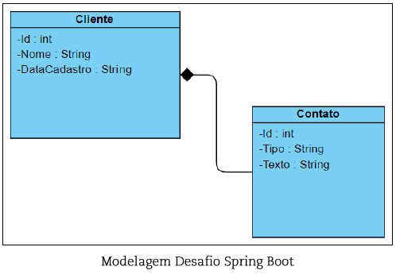

# Muralis - Desafio Spring Boot

## Descrição

Este projeto foi desenvolvido como parte do processo seletivo para uma vaga de estágio. O objetivo é demonstrar habilidades técnicas básicas em back-end utilizando Java e o framework Spring Boot. O projeto permite o cadastramento, consulta, exclusão, listagem, pesquisa e alteração de clientes, seguindo uma modelagem específica.

## Modelagem

O sistema é baseado nas seguintes entidades:

### Cliente
- `id` (int): Identificador único do cliente.
- `nome` (String): Nome do cliente.
- `dataCadastro` (String): Data em que o cliente foi cadastrado.

### Contato
- `id` (int): Identificador único do contato.
- `tipo` (String): Tipo de contato (ex.: e-mail, telefone).
- `texto` (String): Informação de contato.

### Relação
- A relação entre Cliente e Contato é de composição, onde um Cliente pode ter vários Contatos.



## Arquitetura do Projeto

Este projeto segue uma arquitetura organizada em camadas, cada uma com responsabilidades bem definidas. Abaixo está a descrição de cada camada e suas respectivas classes:

### Camadas

1. **DTO (Data Transfer Object)**: Responsável por transportar dados entre as camadas da aplicação.
   - `ClienteDTO.java`: Objeto de transferência de dados para a entidade Cliente.
   - `ContatoDTO.java`: Objeto de transferência de dados para a entidade Contato.

2. **Mapper**: Responsável por mapear entidades para DTOs e vice-versa.
   - `ClienteMapper.java`: Mapeia a entidade Cliente para ClienteDTO e vice-versa.
   - `ContatoMapper.java`: Mapeia a entidade Contato para ContatoDTO e vice-versa.

3. **Service**: Contém a lógica de negócios da aplicação.
   - `ClienteService.java`: Contém a lógica de negócios para operações relacionadas a clientes.

4. **Domain**
   - **Model**: Contém as classes de domínio da aplicação.
     - `Cliente.java`: Representa a entidade Cliente.
     - `Contato.java`: Representa a entidade Contato.
   - **Repository**: Interface para operações de acesso a dados.
     - `ClienteRepository.java`: Interface de repositório para a entidade Cliente.
     - `ContatoRepository.java`: Interface de repositório para a entidade Contato.

5. **Infrastructure**
   - **Controller**: Contém os controladores que lidam com as requisições HTTP.
     - `ClienteController.java`: Controlador para gerenciar as operações relacionadas a clientes.

6. **Resources**
   - **assets**: Diretório para armazenar recursos estáticos, como imagens, arquivos CSS, etc.
   - `application.properties`: Arquivo de configuração da aplicação.

### Estrutura de Pastas

- `src/main/java/br/com/muralis/desafiospringboot`
  - **application**
    - **dto**
      - `ClienteDTO.java`
      - `ContatoDTO.java`
    - **mapper**
      - `ClienteMapper.java`
      - `ContatoMapper.java`
    - **service**
      - `ClienteService.java`
  - **domain**
    - **model**
      - `Cliente.java`
      - `Contato.java`
    - **repository**
      - `ClienteRepository.java`
      - `ContatoRepository.java`
  - **infrastructure**
    - **controller**
      - `ClienteController.java`
  - `DesafioSpringbootApplication.java`
- `src/main/resources`
  - **assets**
  - `application.properties`
- `src/test/java/br/com/muralis/desafiospringboot`
  - `ClienteControllerTest.java`
  - `ClienteServiceTest.java`
  - `DesafioSpringbootApplicationTests.java`

### Descrição das Classes

- **`ClienteDTO`**: Define a estrutura de dados para transferir informações sobre clientes.
- **`ContatoDTO`**: Define a estrutura de dados para transferir informações sobre contatos.
- **`ClienteMapper`**: Converte objetos Cliente para ClienteDTO e vice-versa.
- **`ContatoMapper`**: Converte objetos Contato para ContatoDTO e vice-versa.
- **`ClienteService`**: Implementa a lógica de negócios para operações de clientes.
- **`Cliente`**: Classe de domínio que representa um cliente.
- **`Contato`**: Classe de domínio que representa um contato.
- **`ClienteRepository`**: Interface de repositório para acesso a dados de clientes.
- **`ContatoRepository`**: Interface de repositório para acesso a dados de contatos.
- **`ClienteController`**: Controlador para gerenciar requisições HTTP relacionadas a clientes.
- **`DesafioSpringbootApplication`**: Classe principal da aplicação Spring Boot.

Com essa estrutura, o projeto é modular e de fácil manutenção, seguindo boas práticas de desenvolvimento com a separação clara de responsabilidades.

## Funcionalidades

O projeto implementa as seguintes funcionalidades:

- **Cadastro de Clientes**: Permite adicionar novos clientes ao sistema.
- **Consulta de Clientes**: Permite consultar informações de um cliente específico.
- **Exclusão de Clientes**: Permite remover clientes do sistema.
- **Listagem de Clientes**: Permite listar todos os clientes cadastrados.
- **Pesquisa de Clientes**: Permite pesquisar clientes com base em critérios específicos.
- **Alteração de Clientes**: Permite atualizar as informações de um cliente existente.

## Tecnologias Utilizadas

- **Java 21**: Linguagem de programação utilizada.
- **Spring Boot**: Framework para desenvolvimento de aplicações Java.
- **PostgreSQL**: Banco de dados utilizado para persistência de dados.
- **Maven**: Gerenciador de dependências e construção do projeto.
- **Postman**: Ferramenta para teste e documentação de APIs. Utilizada para testar os endpoints da API, garantindo que todas as funcionalidades estejam funcionando conforme o esperado e para gerar documentação interativa.

## Como Executar

1. **Clone o repositório:**
   ```bash
   git clone https://github.com/devLuanRodrigues/muralis-desafio-spring-boot

2. **Navegue até o repositório do projeto**
   ```bash
   cd muralis-desafio-spring-boot

3. **Compile e execute o projeto com Maven**
   ```bash
   mvn spring-boot:run

4. **Acesse a API**
   A API estará disponível em http://localhost:8080

## Endpoints
**Abaixo estão os principais endpoints da API**

* **POST** /clientes: Cadastrar um novo cliente


* **GET** /clientes/{id}: Consultar um cliente por ID


* **GET** /clientes: Listar todos os clientes


* **PUT** /clientes/{id}: Alterar informações um cliente existente por id


* **DELETE** /clientes/{id}: Excluir um cliente por ID


